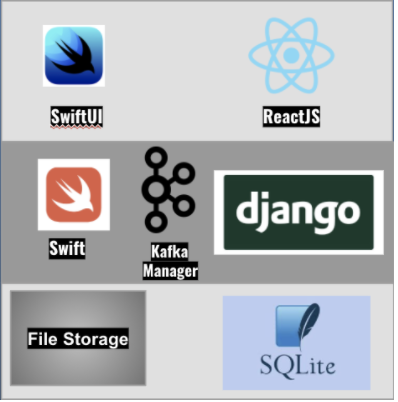

# AppEase
An iWatch application which detects, tracks and helps alleviate anxiety attacks in children and teenagers. It aids doctors and parents monitor children's health data and develop a plan for their treatment.

# How To Run
Each step should be carried out in a separate terminal window. You need your IP address to begin the process

1. Start Zookeeper - 
    1. `zookeeper-server-start /usr/local/etc/kafka/zookeeper.properties`
2. Start Kafka Manager -
    1. `vi /usr/local/etc/kafka/server.properties` and change the following line in the format `advertised.listeners=PLAINTEXT://<IP address>:9092`
    2. `kafka-server-start /usr/local/etc/kafka/server.properties`
3. Start Kafka Consumer -
    1. `python kafkaConsumer.py`
4. Go in AppeasePlatform directory and then the backendapi folder -
    1. `pip install -r requirements.txt`
    2. `python manage.py runserver <IP address>:8000`
5. Go in AppeasePlatform directory and then the frontend/src/components folder -
    1. In the frontend folder, `npm i`
    2. In the dashboard.js file, change the line: `const backendAddress = “<IP address>”`
    3. In the frontend folder, `npm start`
6. Open the Xcode project and change the following two files
    1. `KafkaManager.swift` and `LoginManager.swift` and change the line number 20 with your IP address
    2.  Change the bundle ID to <Your iOS app bundle ID> and do the same thing for the WatchKit app and WatchKit Extension target. The bundle IDs should be <Your iOS app bundle ID>.watchkitapp and <Your iOS app bundle ID>.watchkitapp.watchkitextension, respectively.
    3. Next, open the Info.plist file of the WatchKit app target, and change the value of WKCompanionAppBundleIdentifier key to <Your iOS app bundle ID>.
    4. Open the Info.plist file of the WatchKit Extension target, change the value of the NSExtension > NSExtensionAttributes > WKAppBundleIdentifier key to <Your iOS app bundle ID>.watchkitapp.
    5. Run the watch app first and then the phone app

# Implementation

## WatchOS Application

This fetches real-time biometric, activity and location data. Notifies the user to play games, listen to calming music or call somewhen during an anxiety attack

## iOS Application

The iOS application was primarily designed for authentication and file transfer purposes.

## Web Application

The web application is for parents and doctors to monitor their child’s health information. The dashboard also has visualizations that can help parents and doctors visualize the information and compare it over a period of time. 

# Architecture

# Tech Stack

