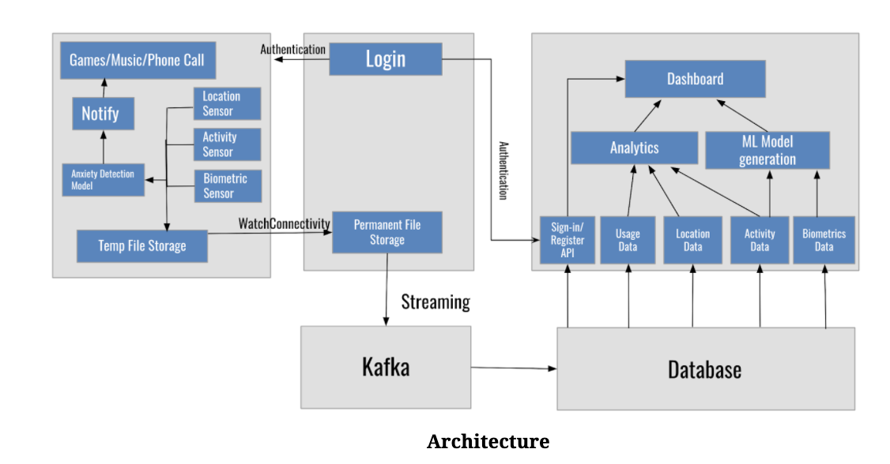

# AppEase
An iWatch application which can detect, track and alleviate anxiety attacks.

# The objectives of this project are:
1. To help children and teenagers deal with anxiety.
2. To help doctors and parents of these children monitor their health data and develop a plan for the child's treatment.

# The implementation can be split into 3 parts:

1. WatchOS Application
2. iOS Application
3. Web Application

# WatchOS Application:

This fetches real-time biometric, activity and location data. Notifies the user to play games, listen to calming music or call somewhen during an anxiety attack

# iOS Application:

The iOS application was primarily designed for authentication and file transfer purposes.

# Web Application:

The web application is for parents and doctors to monitor their child’s health information. The dashboard also has visualizations that can help parents and doctors visualize the information and compare it over a period of time. 

# Tech Stack:

Web Application:\
React
Django

iOS and watchOS Application:\
SwiftUI

Data Pipeline:\
Kafka Manager

Database:\
SQLite3

# Architecture:

